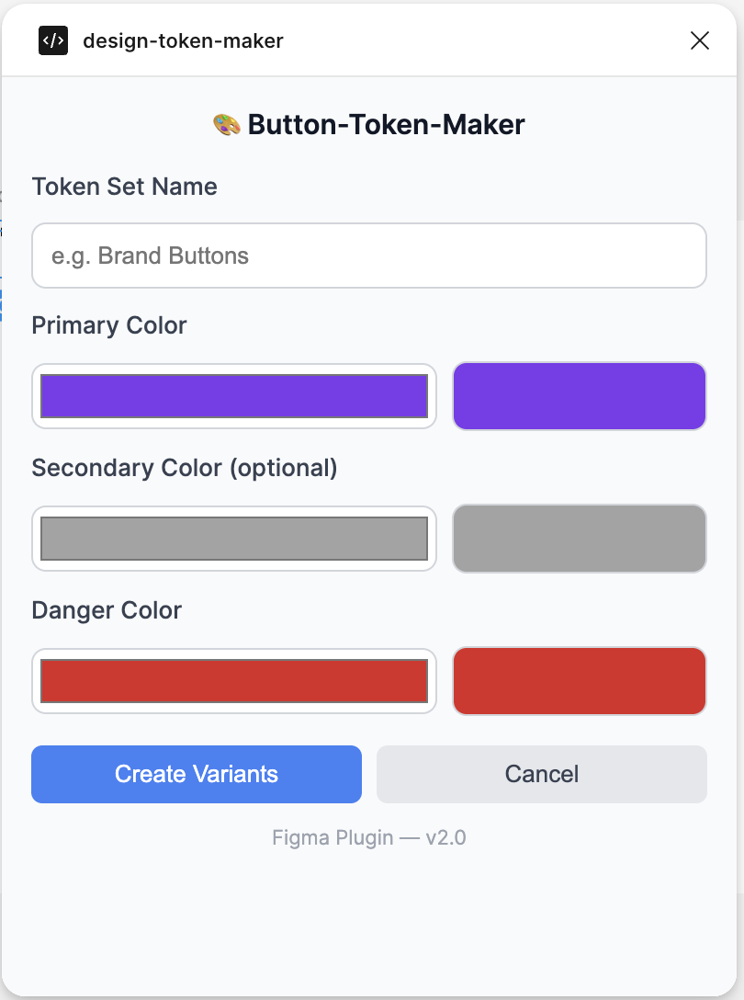
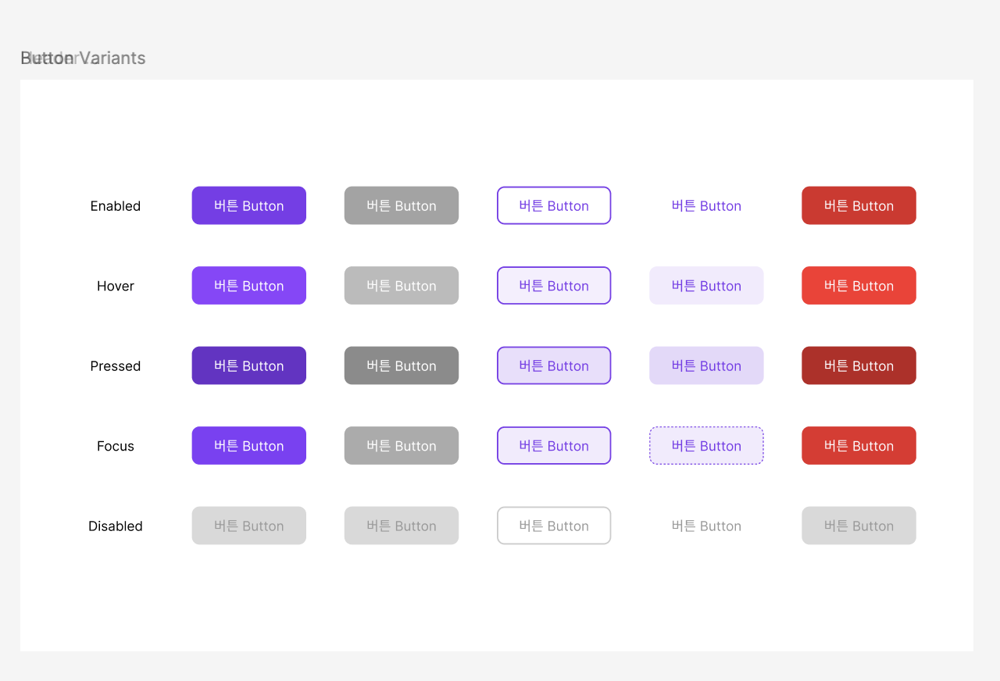

# Button-Token-Maker

Figma 디자인 시스템을 위한 버튼 배리언트 자동 생성 플러그인입니다. 5가지 버튼 타입과 5가지 상태를 한 번에 생성하여 디자인 작업 시간을 단축할 수 있습니다.

## ✨ 주요 기능

- **5가지 버튼 타입**: Primary, Secondary, Ghost, Text, Danger
- **5가지 상태**: Enabled, Hover, Pressed, Focus, Disabled
- **커스텀 컬러**: Primary, Secondary, Danger 색상을 자유롭게 설정
- **자동 배리언트 생성**: 총 25개의 버튼 배리언트를 한 번에 생성
- **일관된 디자인 시스템**: 자동으로 계산된 hover/pressed 상태 색상

## 📦 설치 방법

- 추후 배포 예정이니 배포 후에 명시하도록 하겠습니다 -!

## 🚀 사용 방법

1. Figma에서 플러그인 실행: `Plugins` → `Button-Token-Maker`
2. 원하는 색상 입력 (HEX 코드 / Color picker)
   - **Primary Color**: 주요 버튼 색상
   - **Secondary Color**: 보조 버튼 색상
   - **Danger Color**: 위험/삭제 버튼 색상
3. `Create Variants` 클릭
4. 캔버스에 자동으로 생성된 버튼 배리언트 확인

## 🎨 버튼 타입 설명

### Primary Button

기본 solid 스타일 버튼으로, 가장 중요한 액션에 사용합니다.

### Secondary Button

보조 액션에 사용되는 버튼으로, Primary보다 낮은 우선순위입니다.

### Ghost Button

테두리만 있는 투명 배경 버튼으로, 경량 액션에 적합합니다.

- Hover/Pressed 시 subtle한 배경색 추가

### Text Button

테두리와 배경이 없는 텍스트 전용 버튼입니다.

- Focus 시 점선(dash) 테두리 표시

### Danger Button

삭제, 취소 등 위험한 액션에 사용되는 경고 버튼입니다.

## 🎯 상태별 동작

| 상태         | 설명                            |
| ------------ | ------------------------------- |
| **Enabled**  | 기본 상태                       |
| **Hover**    | 마우스 오버 시 (색상 15% 밝게)  |
| **Pressed**  | 클릭 시 (색상 15% 어둡게)       |
| **Focus**    | 키보드 포커스 시 (색상 5% 밝게) |
| **Disabled** | 비활성화 상태 (회색)            |

## 🛠 기술 스택

- **Figma Plugin API**
- **TypeScript**
- **HTML/CSS** (UI)

## 🎨 기본 색상

플러그인의 기본 색상은 다음과 같습니다:

- **Primary**: `#7C3AED` (Purple)
- **Secondary**: `#6B7280` (Gray)
- **Danger**: `#DC2626` (Red)

## 📸 스크린샷

### 생성된 버튼 배리언트

## 👤 작성자

제작 및 문의: Db0111

---

**⭐ 이 플러그인이 유용했다면 Star를 눌러주세요!**
